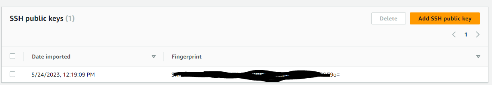
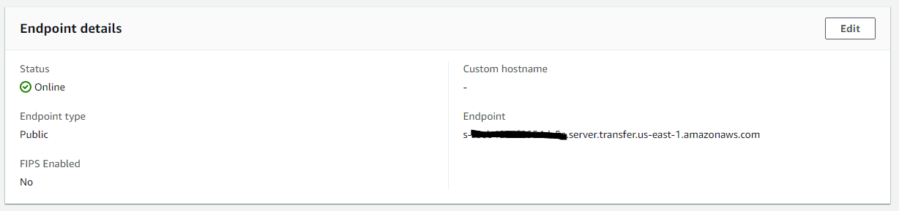
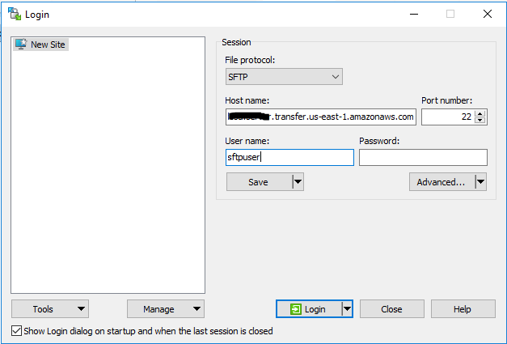
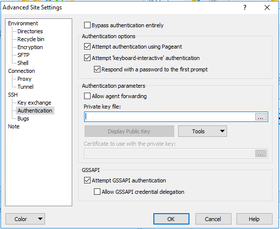
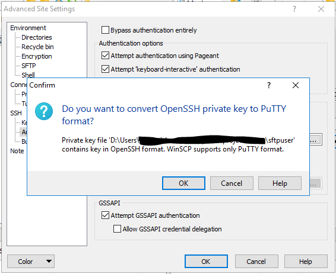
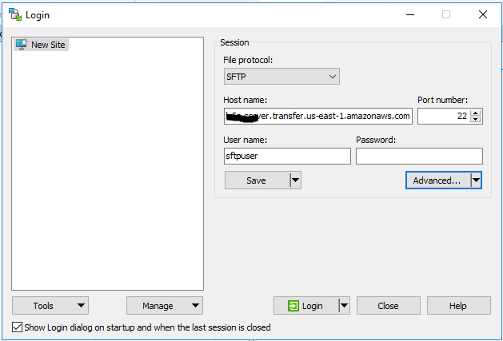
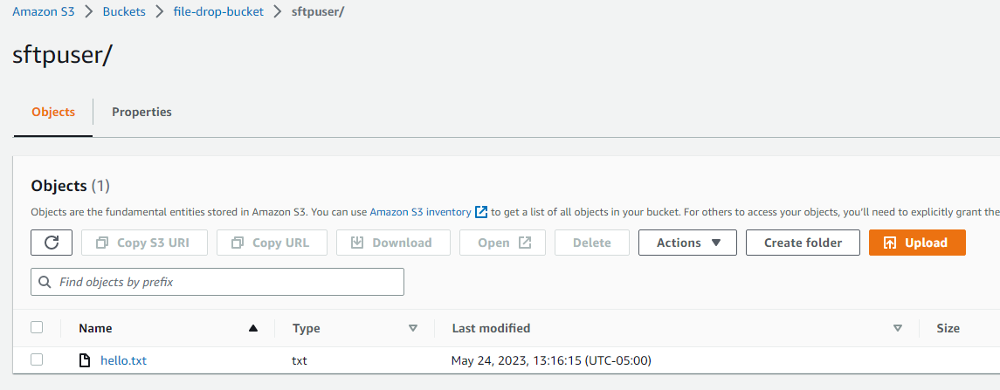

# An Example of AWS Transfer Family using AWS CDK

This example creates an AWS Transfer Family Server and an User.  Only supports SFTP.  It is deployed using AWS CDK.

## Steps to run and test
* Run the following on your command window to create Private and Public Certs: `sftpuser` and `sftpuser.pub`
  * `ssh-keygen -t rsa -b 4096 -f sftpuser`
* Once you have the certs, get the content of the `sftpuser.pub` and we will have to add it to AWS SSM Parameter Store.
* Log into AWS Console.  Go to AWS SSM Parameter Store and add the Public Key under this name: `sftpUserPublicKey`
* Now, Run the pipeline. Wait for the pipeline to finish.  The server will be created.
* Log into AWS Console. Go to AWS Transfer Family, Find your server and click on it. Click on the sftpuser under Users. Then in the SSH Public Keys section, verify your public key.
  *   
* We need a SFTP client for our test.  Download WinSCP from their website (https://winscp.net/eng/index.php).
* Once installed, lets setup the connection and user information.
* First get the Server endpoint and username from AWS.  Go to AWS Transfer Family, Find your server and click on it.
  * 
* Add the information to WinSCP
  * 
* Click on the Advanced button.  We are going to setup Private key file for SSH connection.
  * 
* WinSCP will convert the private key file to .ppk extension.  Convert the fileusing the prompts and click ok.
  * 
* Now click on the Login Button and you should be logged in.
  * 
* Now find a local file to your left and drag it to right.  You should see that is mapped to the S3 Bucket where we need to store the file.
  * 
* Now go to AWS S3 Bucket and see your file.
  * 

## Next Steps
* Add Virus Scanning
* Secure endpoints with IDP