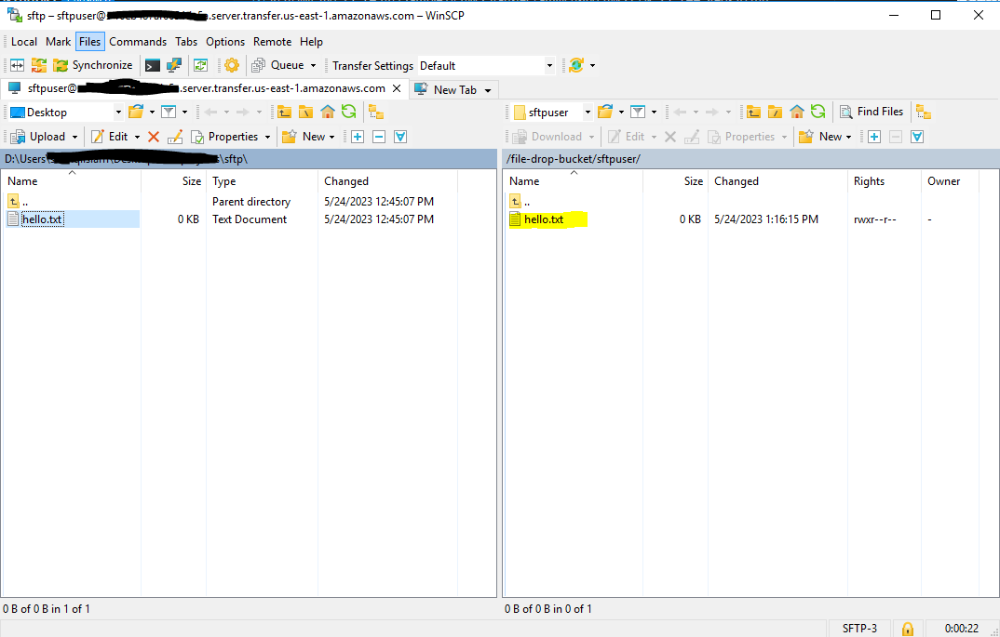

# An Example of AWS Transfer Family using AWS CDK

This example creates an AWS Transfer Family Server and an User.  Only supports SFTP.  It is deployed using AWS CDK.

## Steps to run
* Run the pipeline. Wait for the pipeline to finish.  The server will be created.
* Run the following command on your command window to create a Public and Private Certs: `sftpuser` and `sftpuser.pub`
  * `ssh-keygen -t rsa -b 4096 -f sftpuser`
* Once you have the certs, get the content of the `sftpuser.pub` and we will have to add it to the user...
* Log into AWS Console.  Go to AWS Transfer Family, Find your server and click on it.  Click on the `sftpuser` under Users.  Then in the SSH Public Keys section, click on `Add SSH Public Key` and then paste your public key.
  * 
* We need a SFTP client.  Download WinSCP from their website.
* Once installed, lets setup the connection and user information.
* First get the Server endpoint and username from AWS.  Go to AWS Transfer Family, Find your server and click on it.
  * 
* Add the information to WinSCP
  * 
* Click on the Advanced button.  We are going to setup Private key file for SSH connection.
  * 
* WinSCP will convert the private key file to .ppk extension.  Convert the fileusing the prompts and click ok.
  * 
* Now click on the Login Button and you should be logged in.
  * 
* Now find a local file to your left and drag it to right.  You should see that is mapped to the S3 Bucket where we need to store the file.
  * 
* Now go to AWS S3 Bucket and see your file.
  * 
